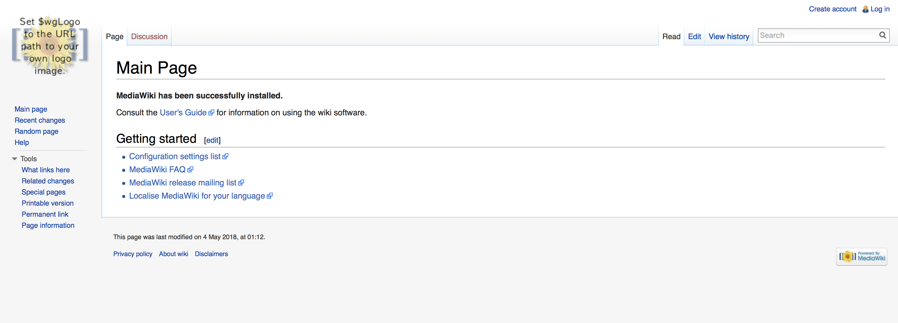
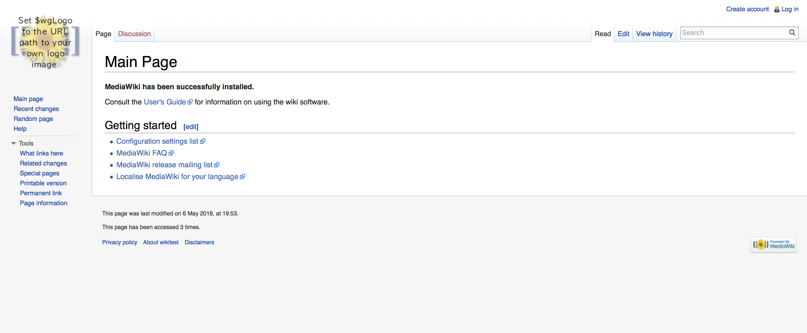

# Templates and Hiera
In this lab we are going to replace the manual process of filling out the MediaWiki installation wizard, downloading `LocalSettings.php` and then uploading it back to the server.  We will instead create a template file to dynamically fill in our settings file. 

## ERB Template
First we're going to start off by replacing the following parameters in `LocalSettings.php` so they look like the following. 
```
$wgSitename = "<%= @wikisitename %>";
$wgServer = "<%= @wikiserver %>";
$wgDBserver = "<%= @wikidbserver %>";
$wgDBname = "<%= @wikidbname %>";
$wgDBuser = "<%= @wikidbuser %>";
$wgDBpassword = "<%= @wikidbpassword %>";
$wgUpgradeKey = "<%= @wikiupgradekey %>";
```

Now that we've done that let's copy the contents of `LocalSettings.php` file and paste it into `/etc/puppetlabs/code/environments/production/modules/mediawiki/templates/LocalSettings.erb`
You will need to create the templates directory. 


Add the file resources to our `init.pp` so it looks like the following. 
```
  file { 'LocalSettings.php':
    path    => '/var/www/html/LocalSettings.php',
    ensure  => 'file',
    content => template('mediawiki/LocalSettings.erb'),
  }
```


After creating the template and the file resource we need to fill in all the variables with our specific values in `nodes.pp`

In our `wiki` node definition we need to add the following variables:
```
$wikisitename = 'wiki'
$wikiserver = "http://172.31.0.202"
$wikidbserver = 'localhost'
$wikidbname = 'wiki'
$wikidbuser = 'root'
$wikidbpassword = 'training'
$wikiupgradekey = 'puppet'
```

After filling in all the values log into the `wiki` server and run the `puppet agent`

Did it successfully run? 

If so go ahead and load [MediaWiki](http://172.31.0.202) from the CentOS VM in your browser. 

You should see a screen like this: 



## Improvements
### MySQL 
The process we used to install this included manual steps of walking through the installation wizard and then the values were put into `LocalSettings.php`, which we then converted to `LocalSettings.erb`. 

MediaWiki created the database tables and structure within MySQL. If we tried to run this on a new node it would fail because the database structure and data does not exist.   
This is something we could automate with Puppet by creating the database structure and populating it, however we are not going to do that right now. 

Puppet will only created the `LocalSettings.php` file if we run Puppet. It will NOT create the database structure unless we add code to do that. 

## Hiera
Templates are great but they require us to create new variables and define their values for every single node.  This can become extremely unwieldy, as we continue to expand and bring on new nodes.  To fix this we are going to use `Hiera` to look at our data sources and pull out the info that is assigned to each node. 

We are going to start by setting each of our required variables to search `Hiera` for the values. 

In `init.pp` add the following to the top of the  `mediawiki` class.
```
$wikimetanamespace = lookup('mediawiki::wikimetanamespace')
$wikisitename = lookup('mediawiki::wikisitename')
$wikiserver = lookup('mediawiki::wikiserver')
$wikidbserver = lookup('mediawiki::wikidbserver')
$wikidbname = lookup('mediawiki::wikidbname')
$wikidbuser = lookup('mediawiki::wikidbuser')
$wikidbpassword = lookup('mediawiki::wikidbpassword')
$wikiupgradekey = lookup('mediawiki::wikiupgradekey')
```

We are now going to edit our `hiera.yaml` file to specify where `Hiera` should look for configuration values. 

Remember that by default `Hiera` looks in `%{codedir}/environments/%{environment}/hiera.yaml` so we need to update it with the following. 
```
---
version: 5
defaults:
  datadir: data
  data_hash: yaml_data
hierarchy:
  - name: "Per-node data (yaml version)"
    path: "nodes/%{trusted.certname}.yaml"
  - name: "Other YAML hierarchy levels"
    paths:
      - "wikidefault.yaml"
```

This tells `Hiera` to look for config values in `%{datadir}/nodes/<node_name>` and if it doesn't match to fall back to `%{datadir}/wikidefault.yaml`

Now we need to populate these files.   Let's start with `wiki.example.lab.yaml` 

Put the following in it. 
```
---
classes:
        - mediawiki
        - linux
mediawiki::wikisitename: wiki
mediawiki::wikimetanamespace: Wiki
mediawiki::wikiserver: http://172.31.0.202
mediawiki::wikidbname: wiki
```

We are defining the values that are relevant to our `wiki.example.lab` node and also telling `Hiera` that it is part of the `mediawiki` and `linux` classes. 

Now we need to put some values into `wikitest.example.lab.yaml`

Based on the values from above update this file making sure to change it to match `wikitest`. 


```
---
classes:
        - mediawiki
        - linux
mediawiki::wikisitename: wikitest
mediawiki::wikimetanamespace: Wikitest
mediawiki::wikiserver: http://172.31.0.203
mediawiki::wikidbname: wikitest

```

Now go ahead and add following values to `wikidefault.yaml`
```
---
mediawiki::wikidbserver: localhost
mediawiki::wikidbuser: root
mediawiki::wikidbpassword: training
mediawiki::wikiupgradekey: puppet
```

Now that we've defined all of our values and setup the `Hiera` files we need to clean up our `nodes.pp` file

Start by deleting all the `$wiki` variables from the top of it. 
```
$wikisitename
$wikimetanamespace
$wikidbserver
...
```

Now add the following to the `wiki` and `wikitest` node definitions. 
This tells puppet to check the classes defined in our `Hiera` data files for values to our variables. 
```
lookup('classes', Array[String], 'unique').include
```

Remove the following lines from `nodes.pp` for both `wiki.example.lab` and `wikitest.example.lab`
```
class {'linux':}
class {'mediawiki':}
```

Now that we've got all of our `Hiera` data files updated and our `nodes.pp` and `init.pp` are configured to point to `Hiera`  we should test it and make sure all the values are returning successfully. 

Using `puppet lookup`  we can test each of the values and determine if they are being returned correctly. 

Start by listing the classes that `Hiera` knows about. 
```
sudo puppet lookup --environment production classes --node wikitest.example.lab
``` 

We have to specify the `node` because the `wikidefault.yaml` file doesn't have any classes defined. 

Now that we know it can see our classes let's check the different variables. This will check the value for `wikidbname` in the `mediawiki` class.   This can be replaced with any of the other defined variables, like `wikidbuser`, `wikimetanamespace` or `wikisitename`
```
sudo puppet lookup --environment production mediawiki::wikidbname --node wikitest.example.lab
```

### Wiki (CentOS 6) 
Log into the `Wiki` vm, run the puppet agent and confirm it completes successfully. 

### Wikitest (Ubuntu) 
If you remember we have not actually gone through the `Mediawiki` installation wizard on this VM.  We have to run through it manually first so that it populates the database with the values we need based on our `Hiera` configuration. 

Visit the [Wikitest site](http://172.31.0.203) in your browser and run through the installation process, when you get to the MySQL settings page fill in following: 
```
Database name: wikitest
Database username: root 
Database password: training
```

Click `Continue`  two more times

Fill in the following fields: 
```
Name of wiki: wikitest  
Your username: admin 
Password: training 
Password again: training 
```

then click the radio button `I'm bored already, just install the wiki` and click `Continue`  three more times, at this point it will prompt you to download the `LocalSettings.php` file but this isn't required any more so just ignore that step. 

Now log into the `wikitest` server and run the puppet agent. 

After the agent completes go back and load the [Wikitest site](http://172.31.0.203) in your browser and you should see something like this: 




# Lab Complete 


