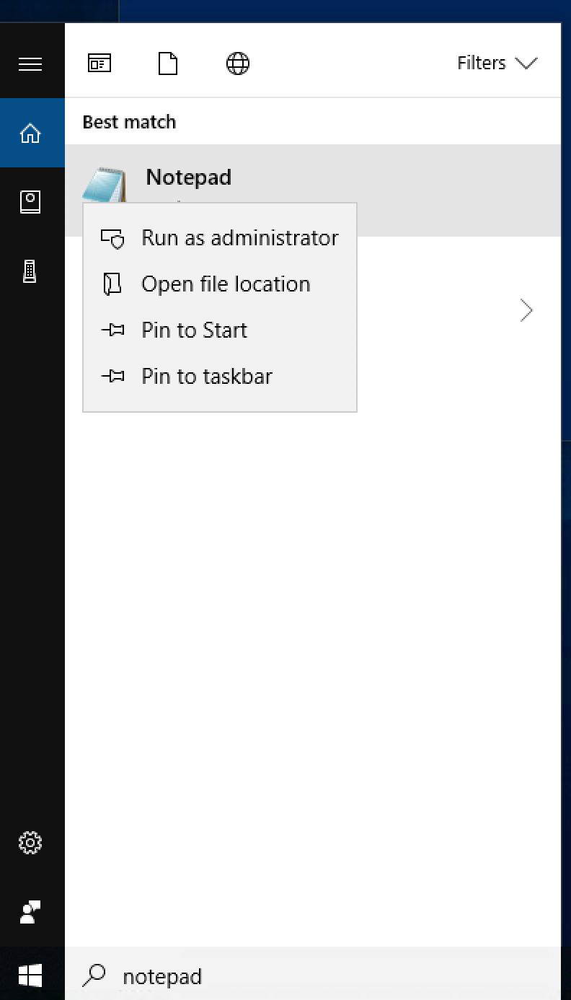
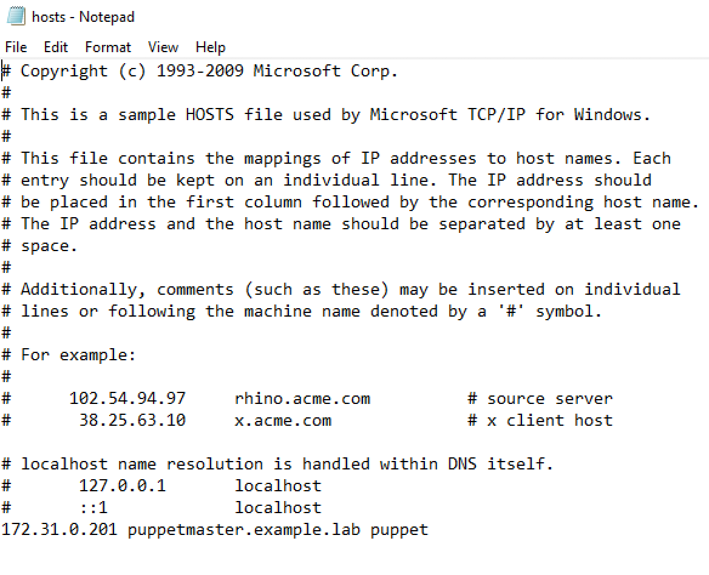
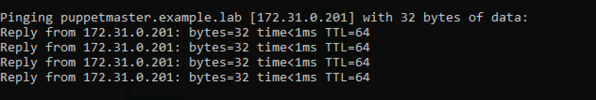
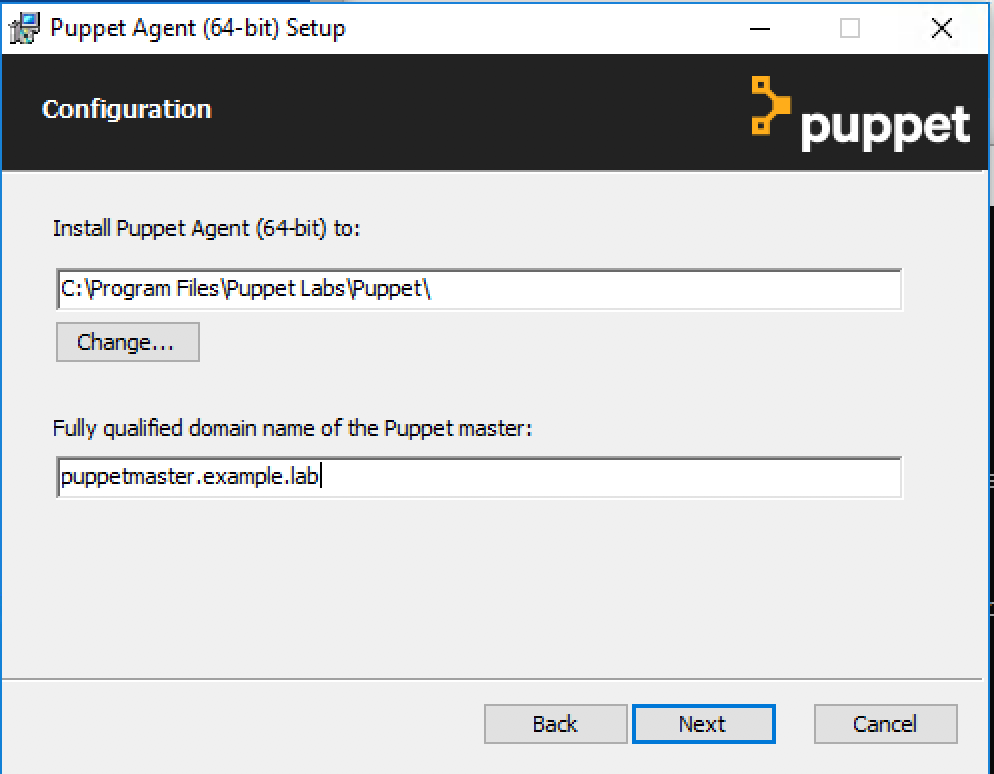
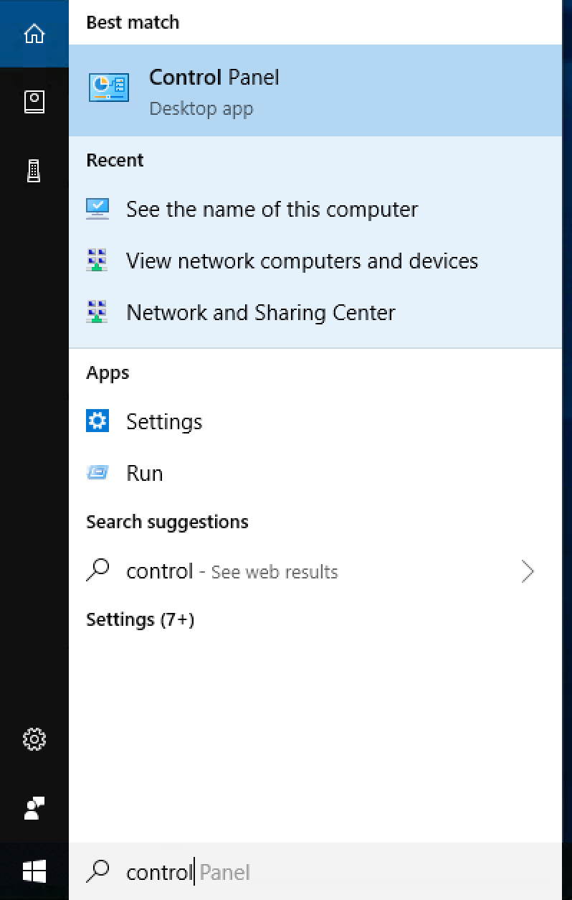
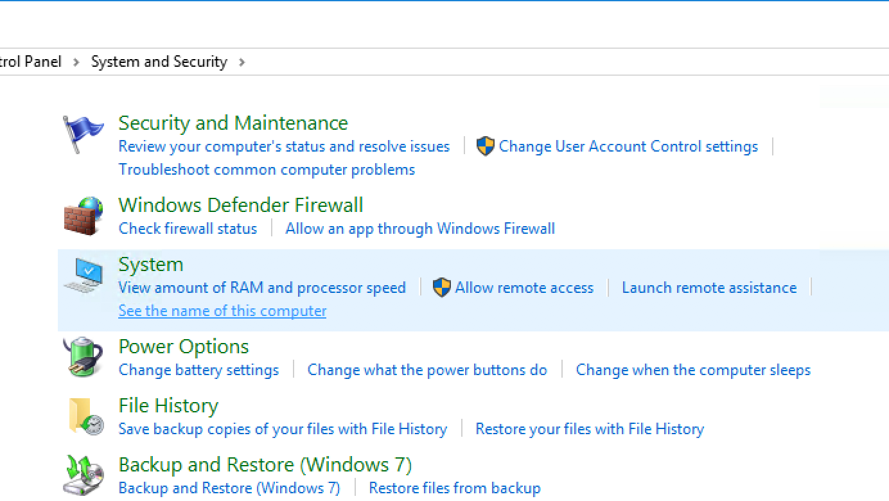
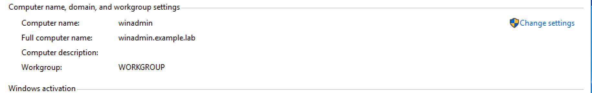
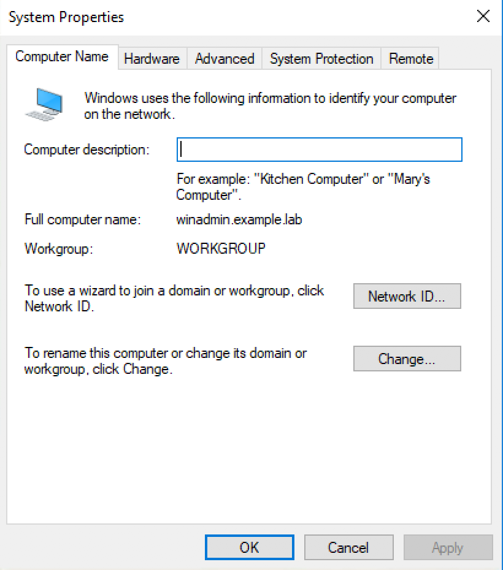
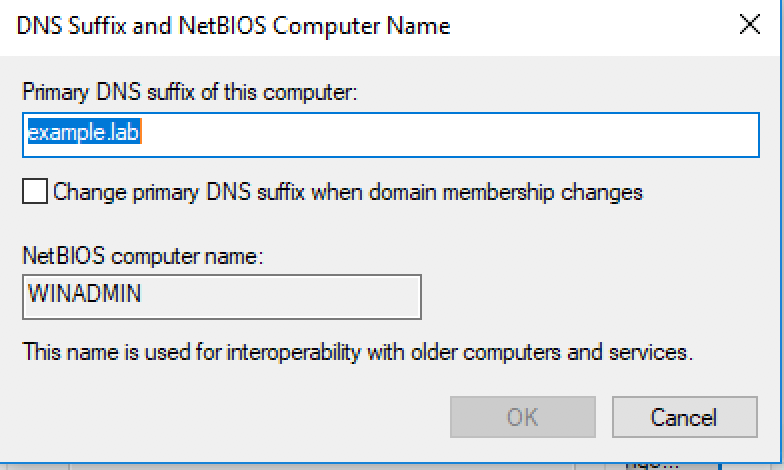

# Windows Agent 
In this lab we will install the Puppet agent on our Windows VM, and configure the needed definitions on the puppet master.

## Puppet agent (Windows)

Start by launching the `winadmin` VM. 
```
vagrant up winadmin 
```

After this is complete to login we are going to run 
```
vagrant rdp winadmin 
```

What this should do is open up your Microsoft Remote Desktop client and connect to the `winadmin` VM.  However if it does not initiate the connection you can create a new one in the Remote Desktop client with the following information. 
```
PC name or IP: 172.31.0.204:3389 
User name: vagrant 
Password: vagrant 
```


After logging into the VM we need to add an entry in the hosts file for the `puppetmaster` 

In the bottom menubar to the right of the `Windows` icon click the search box and type `notepad` then right click it and choose `Run as Administrator`




In the new `Notepad` window open  
`c:\windows\system32\drivers\etc\hosts`

You should see something similar to this: 


Now add a hosts entry for `puppetmaster`

```
172.31.0.201 puppetmaster.example.lab puppet
```

Save the file and then in the search box type `command` and in the new command window run:
```
ping puppetmaster.example.lab 
```

You should get a reply from `puppetmaster`



In a browser [download the Puppet agent](https://downloads.puppetlabs.com/windows/puppet5/puppet-agent-x64-latest.msi)

Run the downloaded file and click next to accept defaults until you get to the Puppet master FQDN, and fill in as below..




Continue clicking `Next` until you get to `Install` and then click `Yes` when asked if the agent should run as administrator. 

At this point we need to change the hostname. To do this we are going to open the `Control Panel`



Click `System and Security` and then in the new screen under `System` click `Set the name of this computer`



Under `Computer name, domain and workgroup` click `Change settings`



In the new window click `Change` 



Now click `More` and fill in the DNS suffix 
```
example.lab 
```



After that is complete click on `OK`, `OK`, `Apply` and finally `OK` and then click no when asked to reboot VM. 

Go back to your workstation terminal and type 
```
vagrant reload winadmin
```

This will reboot the VM and complete the rename process. 

Now that we've installed the Puppet agent, and renamed the VM we need to run the following command in `PowerShell` to generate a certificate request. 

Search for `PowerShell` in the start menu and then right click it and choose `Run as Administrator`

Run the following in the new `PowerShell` window to generate a certificate request.

```
puppet agent --server puppetmaster.example.lab --waitforcert 60 --test
```


## Puppet master configuration

Once this completes log into the `puppetmaster` and run
```
sudo puppet cert list 
```

If you see the certificate request for `winadmin` go ahead and sign it.

After signing our certificate we are going to add a new node definition for `winadmin.example.lab` to our `nodes.pp` manifest. 


In `nodes.pp` we want to add a node definition for `winadmin` underneath our `wikitest` definition.  

We also want to continue using `Hiera` so we need to add the `lookup` function to `winadmin` just like it's setup for our other nodes. 
```
node 'winadmin.example.lab' {
  lookup('classes', Array[String], 'unique').include
}
```

After updating our `nodes.pp` we need to add a new `Hiera` data source for our `winadmin` VM. 

Create a new file  `/etc/puppetlabs/code/environments/production/data/nodes/winadmin.example.lab.yaml` 

In this new file we need to add the following 
```
---
classes: 
  - roles::windows_admin 
```

# Lab Complete