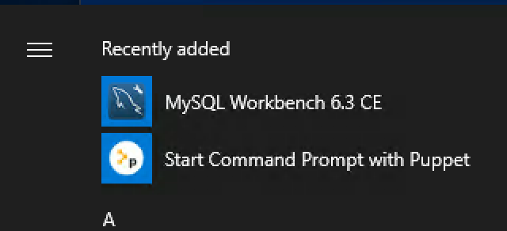
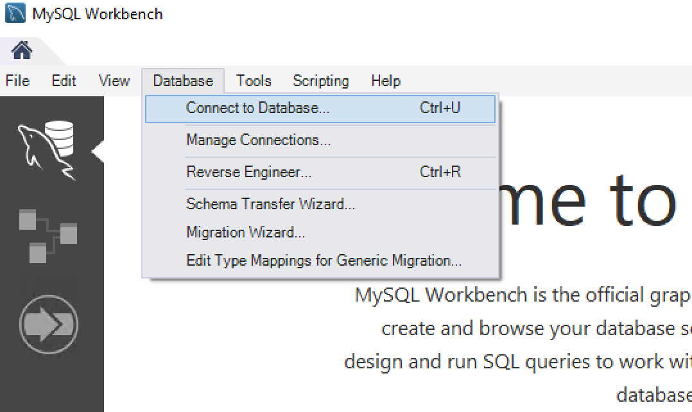
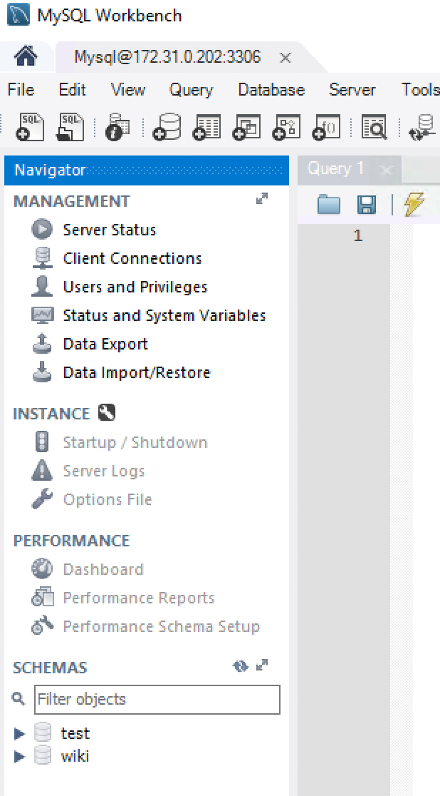

# Roles and Profiles 
As you've seen throughout this course Puppet manifests and modules can become large, complex and confusing.  To help avoid repeating the same code for every node definition we are going to create two new modules, `role` and `profile`.

Start by logging into the the `puppetmaster` node.
```
vagrant ssh puppetmaster 
```

We are now going to create the two modules, let's start with the `role` module.
```
cd /etc/puppetlabs/code/environments/production/modules
sudo puppet module generate <yourname-role> --environment production 
```

Accept the defaults until you get to the description of the module.  At this point go ahead and just type in `Roles module`, and then accept defaults until end.

Then for the `profile` module we are going to do the same thing
```
sudo puppet module generate <yourname-profile> --environment production 
```

Accept the defaults until you get to the description of the module.  At this point go ahead and just type in `Profiles module`, and then accept defaults until end.

Now that we've created the modules let's go modify the `profile` module's `init.pp` 
```
sudo vim /etc/puppetlabs/code/environments/production/modules/profile/manifests/init.pp
```

Scroll to the very bottom of the file and make sure that you add the following **below** the `class profile` definition. 

```
class profile::windows::mysql_workbench {

}

class profile::windows::putty {

}
```

Now let's modify the `role` module's `init.pp` 

```
sudo vim /etc/puppetlabs/code/environments/production/modules/role/manifests/init.pp
```

Add the following at the very bottom **below** the `class role` definition.

```
class role::windows_admin {
  class {'profile::windows::mysql_workbench': }
  class {'profile::windows::putty': }
}
```

## MySQL Workbench
### Prereqs: 

Let's start out by installing the `opentable-download_file` module. 
```
sudo puppet module install opentable-download_file --modulepath /etc/puppetlabs/code/environments/production/modules
```

Edit the new `profile` module's `init.pp` file
```
sudo vim /etc/puppetlabs/code/environments/production/modules/profile/manifests/init.pp
```

Update the file to look like: 
```
class profile {


}
  class profile::windows::mysql_workbench {

    file { 'c:/temp/':
      ensure => 'directory',
  }

    download_file { "Microsoft Visual C++ 2017 Redistributable (x64) - 14.14.26405":
      url                   => 'https://aka.ms/vs/15/release/vc_redist.x64.exe',
      destination_directory => 'c:\temp',
  }

    package { "Microsoft Visual C++ 2017 Redistributable (x64) - 14.14.26405":
      ensure            => 'installed',
      source            => 'c:\temp\vc_redist.x64.exe',
      install_options   => [ '/quiet'],
  }

    download_file { "Microsoft .NET Framework":
      url                   => 'https://download.microsoft.com/download/B/A/4/BA4A7E71-2906-4B2D-A0E1-80CF16844F5F/dotNetFx45_Full_setup.exe',
      destination_directory => 'c:\temp',
  }

    package { "Microsoft .NET Framework":
      ensure            => 'installed',
      source            => 'c:\temp\dotNetFx45_Full_setup.exe',
      install_options   => [ '/q'],
  }


    download_file { "MySQL Workbench 6.3.10 CE":

      url                   => 'https://dev.mysql.com/get/Downloads/MySQLGUITools/mysql-workbench-community-6.3.10-winx64.msi',

      destination_directory => 'c:\temp',

  }


    package { "MySQL Workbench 6.3.10 CE":

      ensure            => 'installed',

      source            => 'c:\temp\mysql-workbench-community-6.3.10-winx64.msi',

  }
}

  class profile::windows::putty {

        file { 'c:/admin tools/':
          ensure => 'directory',
  }


    download_file {"Download Putty":
      url       => 'http://the.earth.li/~sgtatham/putty/latest/w64/putty.exe',
      destination_directory => 'c:\admin tools',
 }

    download_file { "Download Puttygen":
      url           => 'http://the.earth.li/~sgtatham/putty/latest/w64/puttygen.exe',
      destination_directory => 'c:\admin tools',
  }
}
```

Ok, now that we have our `role` and `profile` modules setup let's go back to the `winadmin` machine, open up PowerShell as `admin` and run the `puppet agent` 
```
puppet agent --verbose --no-daemonize --onetime
```

If you get errors regarding it not being able to install because the "The source does not exist" this is expected, if you look at the rest of the output you'll see that it does download it eventually but the resource ordering is a little off.

A quick fix is to run the puppet agent on `winadmin` again and see if everything installs successfully. 
```
puppet agent --verbose --no-daemonize --onetime
```

If the agent run completes successfully it's time to verify that everything was installed as defined in our profiles.

Click the `Windows` button on the menu bar and at the top you should see `MySQL Workbench`



Click on that and if it starts then everything was installed just like we defined! 

A fun thing you can do is log into the `wiki` server and connect to MySQL
```
mysql -uroot -ptraining
```

Then run the following command to allow external connections as the `root` user. 
```
GRANT ALL PRIVILEGES ON *.* TO 'root'@'%' IDENTIFIED BY 'training';
```

Now flush privileges to force it to apply the changes
```
FLUSH PRIVILEGES;
```

After this is done edit the `/etc/my.cnf` file and comment out the `bind-address = 127.0.0.1` line. 

```
sudo vim /etc/my.cnf 
```

```
[mysqld]
basedir = /usr
#bind-address = 127.0.0.1
```

Restart the `mysqld` service 

```
sudo service mysqld restart
```

Go back to the `winadmin` machine and start up `MySQL Workbench`. Once it's running select database at the top and then click `Connect to Database`


In the new window fill in the following: 
```
Hostname: 172.31.0.202
username: root 
```

Click `OK` and you should be prompted to supply your password.  Enter `training` and now you should be connected! 




# Lab Complete 